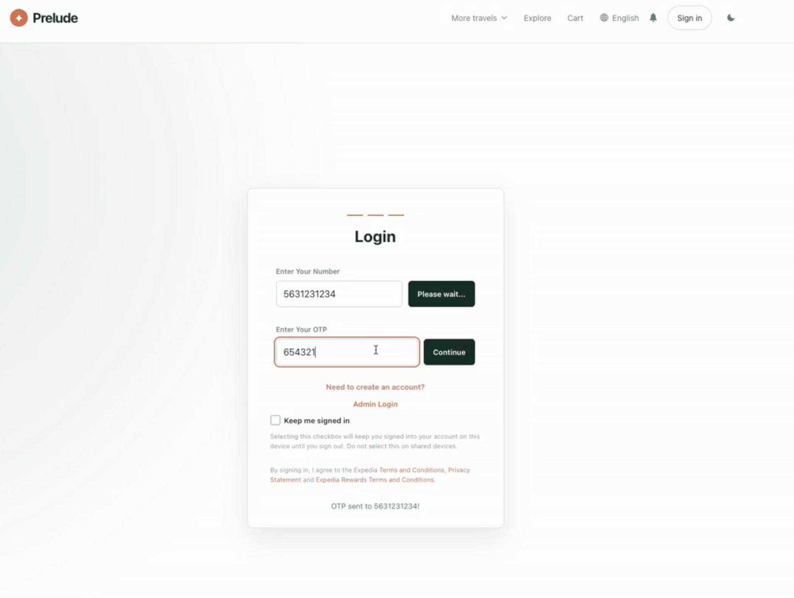
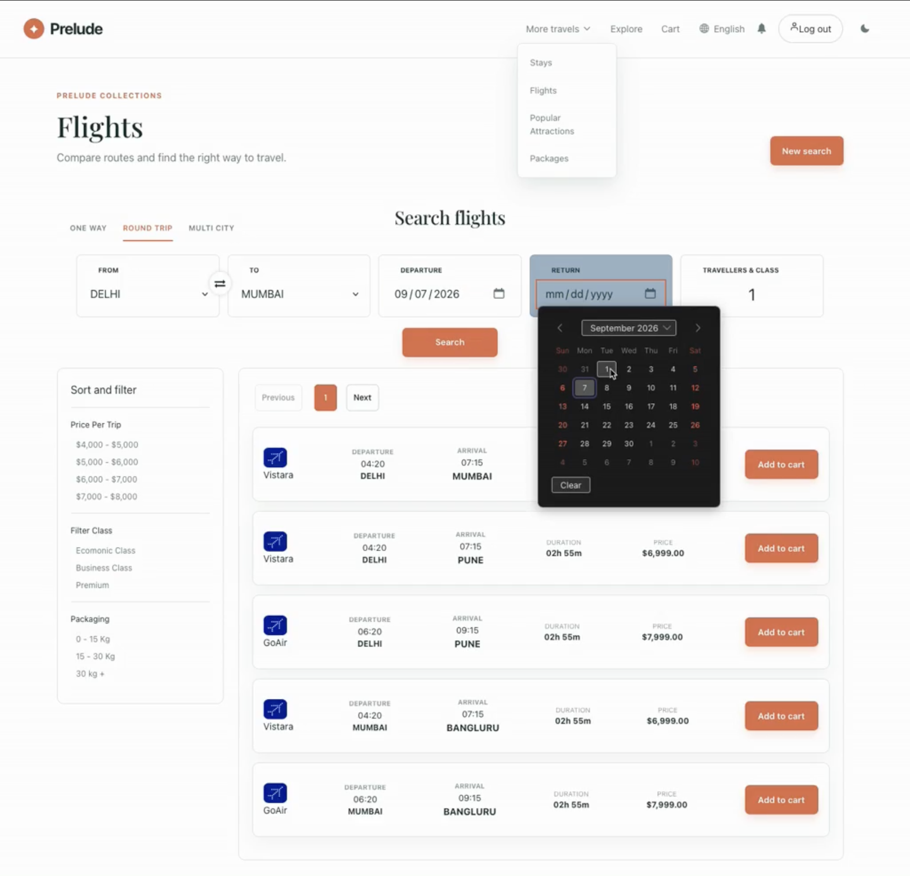
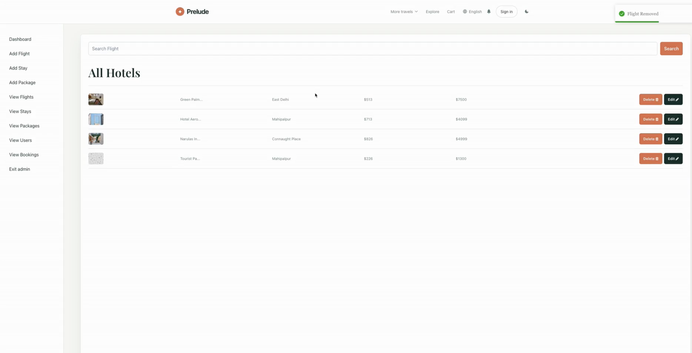

# Prelude

## An travel booking web app for SE/CPRE 3290 Project Management. Search stays and flights, filter by price and rating, and book in a few clicks.

Prelude is a full-stack travel booking application inspired by Expedia. It lets users browse hotels and flights, sort and filter results by price and rating, manage a cart, and complete bookings, backed by a Firebase (Firestore) data layer with a local JSON-Server fallback for development. It was originally cloned from an open-source Expedia clone and then restyled and extended by the team with a new UI, a Firebase backend, and additional features.

Built by a team of four: **Alec Moore, Chris Lopez, Connor Link, and Connor Moroney.**

## Tech Stack

- HTML
- CSS
- JavaScript
- React
- Redux
- JSON-Server
- Firebase (Firestore)

**Key dependencies:** Axios, redux, react-redux, redux-thunk, Chakra UI, firebase, font-awesome, json-server, react-router-dom.

## Features

- Landing page with a restyled Prelude UI
- Login and signup via Firebase (OTP)
- View details of flights and hotels
- Search for flights, hotels, and holiday packages
- Sorting, filtering, and searching (by price and rating)
- Book flights and hotels
- Cart section
- Admin panel

## Installation

To run this project locally, follow the steps below:

Clone the repository by running the following command:
> git clone https://git.ece.iastate.edu/clink1/prelude-team1-s26.git

Navigate to the project directory:
> cd prelude-team1-s26

Install the dependencies:
> npm install

Start the server:
> npm start

(Optional: for local deployments without Firebase/Firestore only) Start JSON-Server:
> npm run server

Open the website in your browser:
> http://localhost:3000/

## Firestore Setup (for Contributors)

1. Prereq: Firestore already created in Firebase Console (      
   project prelude-2c284). Enable Firestore in Test Mode if     
   prompted; rules file is firestore.rules:1                    
2. Config: src/01_firebase/config_firebase.js:9 already has     
   projectId; to use a custom development project, replace firebaseConfig                              
3. Verify SDK: firebase@^9.19.0 already in package.json:16 -    
   just npm install                                             
4. Seed DB (one-time): copies db.json -> collections users/     
   hotels/flights/giftcards + admins + bookings                 
   `node src/01_firebase/seed.js`
5. Local dev without Firestore: app falls back to `npm run server` 
(json-server at http://localhost:8080) - Firestore    
   errors silently fallback via try/catch in actions            
6. Use in code:                                                 
   import { hotelService } from "./01_firebase/firestore";      
   await hotelService.getAll(); // or .search({city:"Gandhi     
   Nagar"})                                                     
   import { db } from "./01_firebase/config_firebase";          
7. Hooks example: src/01_firebase/useFirestore.js:13 -          
   useHotels()                                                  
8. Troubleshooting: Permission denied -> set Rules to allow     
   read, write: if true for testing; Missing or insufficient    
   permissions -> check projectId matches console; no data ->   
   re-run seeder                                                

## Deployment

This project is run via local deployment only. Start it with `npm start` and open `http://localhost:3000/`. There is no public hosted URL. Run `npm run build` to rebuild an optimized copy able to be tested without the React development server running.

Below are the registration (signup) and login pages:

Below is a screenshot of the hotels finder catalog page:

Below is the flights finder catalog page:

Below is one of the administrator panel pages:

